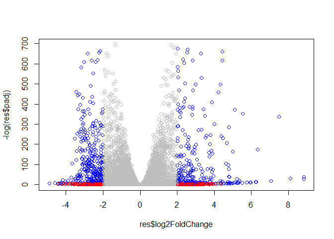
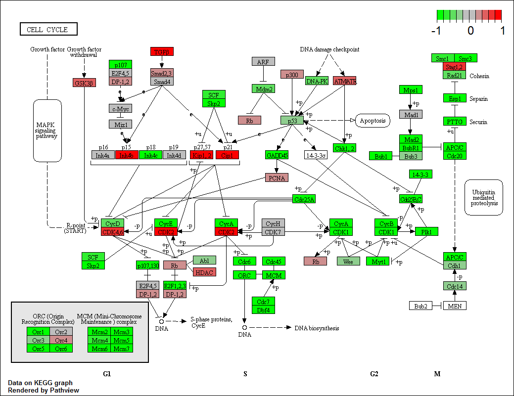

CLASS15
================

DIFFERENTIAL SEQUENCE EXPRESSION
--------------------------------

Loading DESeq2 for use

``` r
library(DESeq2)
```

Loading our data files

``` r
metaFile <- "GSE37704_metadata.csv"
countFile <- "GSE37704_featurecounts.csv"

#Importing Metadata
colData <- read.csv(metaFile, row.names = 1)
head(colData)
```

    ##               condition
    ## SRR493366 control_sirna
    ## SRR493367 control_sirna
    ## SRR493368 control_sirna
    ## SRR493369      hoxa1_kd
    ## SRR493370      hoxa1_kd
    ## SRR493371      hoxa1_kd

``` r
#Importing CountData
countData <- read.csv(countFile, row.names=1)
head(countData)
```

    ##                 length SRR493366 SRR493367 SRR493368 SRR493369 SRR493370
    ## ENSG00000186092    918         0         0         0         0         0
    ## ENSG00000279928    718         0         0         0         0         0
    ## ENSG00000279457   1982        23        28        29        29        28
    ## ENSG00000278566    939         0         0         0         0         0
    ## ENSG00000273547    939         0         0         0         0         0
    ## ENSG00000187634   3214       124       123       205       207       212
    ##                 SRR493371
    ## ENSG00000186092         0
    ## ENSG00000279928         0
    ## ENSG00000279457        46
    ## ENSG00000278566         0
    ## ENSG00000273547         0
    ## ENSG00000187634       258

> Removing the troublesome length column

``` r
#Identifying the qualities of our count data set
dim(countData)
```

    ## [1] 19808     7

``` r
#Adjusting the dimensions of countData
countData <- as.matrix(countData[,-1])
head(countData)
```

    ##                 SRR493366 SRR493367 SRR493368 SRR493369 SRR493370
    ## ENSG00000186092         0         0         0         0         0
    ## ENSG00000279928         0         0         0         0         0
    ## ENSG00000279457        23        28        29        29        28
    ## ENSG00000278566         0         0         0         0         0
    ## ENSG00000273547         0         0         0         0         0
    ## ENSG00000187634       124       123       205       207       212
    ##                 SRR493371
    ## ENSG00000186092         0
    ## ENSG00000279928         0
    ## ENSG00000279457        46
    ## ENSG00000278566         0
    ## ENSG00000273547         0
    ## ENSG00000187634       258

``` r
#Checking if dimensions match up properly
all(rownames(colData)==colnames(countData))
```

    ## [1] TRUE

> Filter out rows in countData with no data in them

``` r
#rowSums to identify rows that are greater than zero, moving those rows into a new vector and applying 
countData2 <- countData[rowSums(countData)>0,]
```

Runing DESeq2
-------------

``` r
dds = DESeqDataSetFromMatrix(countData=countData,
                             colData=colData,
                             design=~condition)
dds = DESeq(dds)
```

    ## estimating size factors

    ## estimating dispersions

    ## gene-wise dispersion estimates

    ## mean-dispersion relationship

    ## final dispersion estimates

    ## fitting model and testing

``` r
dds
```

    ## class: DESeqDataSet 
    ## dim: 19808 6 
    ## metadata(1): version
    ## assays(4): counts mu H cooks
    ## rownames(19808): ENSG00000186092 ENSG00000279928 ...
    ##   ENSG00000277475 ENSG00000268674
    ## rowData names(22): baseMean baseVar ... deviance maxCooks
    ## colnames(6): SRR493366 SRR493367 ... SRR493370 SRR493371
    ## colData names(2): condition sizeFactor

Getting our results

``` r
res = results(dds, contrast=c("condition", "hoxa1_kd", "control_sirna"))
res
```

    ## log2 fold change (MLE): condition hoxa1_kd vs control_sirna 
    ## Wald test p-value: condition hoxa1 kd vs control sirna 
    ## DataFrame with 19808 rows and 6 columns
    ##                         baseMean     log2FoldChange             lfcSE
    ##                        <numeric>          <numeric>         <numeric>
    ## ENSG00000186092                0                 NA                NA
    ## ENSG00000279928                0                 NA                NA
    ## ENSG00000279457 29.9135794276176  0.179257083543324 0.324821566918811
    ## ENSG00000278566                0                 NA                NA
    ## ENSG00000273547                0                 NA                NA
    ## ...                          ...                ...               ...
    ## ENSG00000277856                0                 NA                NA
    ## ENSG00000275063                0                 NA                NA
    ## ENSG00000271254 181.595902546813 -0.609666545195565 0.141320483768649
    ## ENSG00000277475                0                 NA                NA
    ## ENSG00000268674                0                 NA                NA
    ##                              stat               pvalue
    ##                         <numeric>            <numeric>
    ## ENSG00000186092                NA                   NA
    ## ENSG00000279928                NA                   NA
    ## ENSG00000279457 0.551863243699359     0.58104205296243
    ## ENSG00000278566                NA                   NA
    ## ENSG00000273547                NA                   NA
    ## ...                           ...                  ...
    ## ENSG00000277856                NA                   NA
    ## ENSG00000275063                NA                   NA
    ## ENSG00000271254 -4.31407060701569 1.60275720633605e-05
    ## ENSG00000277475                NA                   NA
    ## ENSG00000268674                NA                   NA
    ##                                 padj
    ##                            <numeric>
    ## ENSG00000186092                   NA
    ## ENSG00000279928                   NA
    ## ENSG00000279457     0.68707978275288
    ## ENSG00000278566                   NA
    ## ENSG00000273547                   NA
    ## ...                              ...
    ## ENSG00000277856                   NA
    ## ENSG00000275063                   NA
    ## ENSG00000271254 4.54140192477091e-05
    ## ENSG00000277475                   NA
    ## ENSG00000268674                   NA

Plotting our results

``` r
plot(res$log2FoldChange, -log(res$padj))
```


Coloring the plot

``` r
mycol <-  rep("gray", nrow(res))
#Adjust color scheme by applying rules to color vector which is based on the result vector
mycol[abs(res$log2FoldChange)>2] <- "red"
mycol[abs(res$log2FoldChange)>2 & res$padj<.01] <- "blue"

plot(res$log2FoldChange, -log(res$padj), col = mycol)
```



Adding gene annotations to our results
--------------------------------------

> Add SYMBOL, ENTREZID, and GENENAME annotations to the results file using the Bioconductor mapID() function.

``` r
library("AnnotationDbi")
library("org.Hs.eg.db")
```

    ## 

``` r
columns(org.Hs.eg.db)
```

    ##  [1] "ACCNUM"       "ALIAS"        "ENSEMBL"      "ENSEMBLPROT" 
    ##  [5] "ENSEMBLTRANS" "ENTREZID"     "ENZYME"       "EVIDENCE"    
    ##  [9] "EVIDENCEALL"  "GENENAME"     "GO"           "GOALL"       
    ## [13] "IPI"          "MAP"          "OMIM"         "ONTOLOGY"    
    ## [17] "ONTOLOGYALL"  "PATH"         "PFAM"         "PMID"        
    ## [21] "PROSITE"      "REFSEQ"       "SYMBOL"       "UCSCKG"      
    ## [25] "UNIGENE"      "UNIPROT"

``` r
res$symbol = mapIds(org.Hs.eg.db,
                    keys=row.names(res), 
                    keytype="ENSEMBL",
                    column="SYMBOL",
                    multiVals="first")
```

    ## 'select()' returned 1:many mapping between keys and columns

``` r
res$entrez = mapIds(org.Hs.eg.db,
                    keys=row.names(res),
                    keytype="ENSEMBL",
                    column="ENTREZID",
                    multiVals="first")
```

    ## 'select()' returned 1:many mapping between keys and columns

``` r
res$name =   mapIds(org.Hs.eg.db,
                    keys=row.names(res),
                    keytype="ENSEMBL",
                    column="GENENAME",
                    multiVals="first")
```

    ## 'select()' returned 1:many mapping between keys and columns

``` r
head(res, 10)
```

    ## log2 fold change (MLE): condition hoxa1_kd vs control_sirna 
    ## Wald test p-value: condition hoxa1 kd vs control sirna 
    ## DataFrame with 10 rows and 9 columns
    ##                         baseMean     log2FoldChange              lfcSE
    ##                        <numeric>          <numeric>          <numeric>
    ## ENSG00000186092                0                 NA                 NA
    ## ENSG00000279928                0                 NA                 NA
    ## ENSG00000279457 29.9135794276176  0.179257083543324  0.324821566918811
    ## ENSG00000278566                0                 NA                 NA
    ## ENSG00000273547                0                 NA                 NA
    ## ENSG00000187634 183.229649921658  0.426457118513849  0.140265821358809
    ## ENSG00000188976 1651.18807619944 -0.692720464791275 0.0548465424860911
    ## ENSG00000187961 209.637938486147  0.729755610542653  0.131859900882201
    ## ENSG00000187583 47.2551232589398 0.0405765280481789  0.271892810160349
    ## ENSG00000187642 11.9797501642461  0.542810491962931  0.521559852177308
    ##                              stat               pvalue
    ##                         <numeric>            <numeric>
    ## ENSG00000186092                NA                   NA
    ## ENSG00000279928                NA                   NA
    ## ENSG00000279457 0.551863243699359     0.58104205296243
    ## ENSG00000278566                NA                   NA
    ## ENSG00000273547                NA                   NA
    ## ENSG00000187634  3.04034949057864  0.00236303765813393
    ## ENSG00000188976 -12.6301574063114 1.43989919007885e-36
    ## ENSG00000187961  5.53432548985905 3.12428316941044e-08
    ## ENSG00000187583  0.14923722339053    0.881366448843415
    ## ENSG00000187642  1.04074439337482    0.297994193826297
    ##                                 padj      symbol      entrez
    ##                            <numeric> <character> <character>
    ## ENSG00000186092                   NA       OR4F5       79501
    ## ENSG00000279928                   NA          NA          NA
    ## ENSG00000279457     0.68707978275288          NA          NA
    ## ENSG00000278566                   NA          NA          NA
    ## ENSG00000273547                   NA          NA          NA
    ## ENSG00000187634  0.00516278063203138      SAMD11      148398
    ## ENSG00000188976 1.76741037025153e-35       NOC2L       26155
    ## ENSG00000187961 1.13536142565226e-07      KLHL17      339451
    ## ENSG00000187583    0.918988027295813     PLEKHN1       84069
    ## ENSG00000187642     0.40381723541973       PERM1       84808
    ##                                                                     name
    ##                                                              <character>
    ## ENSG00000186092         olfactory receptor family 4 subfamily F member 5
    ## ENSG00000279928                                                       NA
    ## ENSG00000279457                                                       NA
    ## ENSG00000278566                                                       NA
    ## ENSG00000273547                                                       NA
    ## ENSG00000187634                 sterile alpha motif domain containing 11
    ## ENSG00000188976 NOC2 like nucleolar associated transcriptional repressor
    ## ENSG00000187961                              kelch like family member 17
    ## ENSG00000187583                 pleckstrin homology domain containing N1
    ## ENSG00000187642             PPARGC1 and ESRR induced regulator, muscle 1

Writing our results to a csv file

``` r
#Ordering by pvalues
res = res[order(res$pvalue),]
write.csv(res, file="deseq_results.csv")
```

KEGG pathways
-------------

Installing necessary packages. Will be commented out in final document.

``` r
#source("http://bioconductor.org/biocLite.R")
#biocLite( c("pathview", "gage", "gageData") )
```

Loading KEGG Pathway function

``` r
library(pathview)
```

    ## ##############################################################################
    ## Pathview is an open source software package distributed under GNU General
    ## Public License version 3 (GPLv3). Details of GPLv3 is available at
    ## http://www.gnu.org/licenses/gpl-3.0.html. Particullary, users are required to
    ## formally cite the original Pathview paper (not just mention it) in publications
    ## or products. For details, do citation("pathview") within R.
    ## 
    ## The pathview downloads and uses KEGG data. Non-academic uses may require a KEGG
    ## license agreement (details at http://www.kegg.jp/kegg/legal.html).
    ## ##############################################################################

Loading additional functions and setting KEGG to use relevant pathways

``` r
library(gage)
library(gageData)

data(kegg.sets.hs)
data(sigmet.idx.hs)

# Focus on signaling and metabolic pathways only
kegg.sets.hs = kegg.sets.hs[sigmet.idx.hs]

# Examine the first 3 pathways
head(kegg.sets.hs, 3)
```

    ## $`hsa00232 Caffeine metabolism`
    ## [1] "10"   "1544" "1548" "1549" "1553" "7498" "9"   
    ## 
    ## $`hsa00983 Drug metabolism - other enzymes`
    ##  [1] "10"     "1066"   "10720"  "10941"  "151531" "1548"   "1549"  
    ##  [8] "1551"   "1553"   "1576"   "1577"   "1806"   "1807"   "1890"  
    ## [15] "221223" "2990"   "3251"   "3614"   "3615"   "3704"   "51733" 
    ## [22] "54490"  "54575"  "54576"  "54577"  "54578"  "54579"  "54600" 
    ## [29] "54657"  "54658"  "54659"  "54963"  "574537" "64816"  "7083"  
    ## [36] "7084"   "7172"   "7363"   "7364"   "7365"   "7366"   "7367"  
    ## [43] "7371"   "7372"   "7378"   "7498"   "79799"  "83549"  "8824"  
    ## [50] "8833"   "9"      "978"   
    ## 
    ## $`hsa00230 Purine metabolism`
    ##   [1] "100"    "10201"  "10606"  "10621"  "10622"  "10623"  "107"   
    ##   [8] "10714"  "108"    "10846"  "109"    "111"    "11128"  "11164" 
    ##  [15] "112"    "113"    "114"    "115"    "122481" "122622" "124583"
    ##  [22] "132"    "158"    "159"    "1633"   "171568" "1716"   "196883"
    ##  [29] "203"    "204"    "205"    "221823" "2272"   "22978"  "23649" 
    ##  [36] "246721" "25885"  "2618"   "26289"  "270"    "271"    "27115" 
    ##  [43] "272"    "2766"   "2977"   "2982"   "2983"   "2984"   "2986"  
    ##  [50] "2987"   "29922"  "3000"   "30833"  "30834"  "318"    "3251"  
    ##  [57] "353"    "3614"   "3615"   "3704"   "377841" "471"    "4830"  
    ##  [64] "4831"   "4832"   "4833"   "4860"   "4881"   "4882"   "4907"  
    ##  [71] "50484"  "50940"  "51082"  "51251"  "51292"  "5136"   "5137"  
    ##  [78] "5138"   "5139"   "5140"   "5141"   "5142"   "5143"   "5144"  
    ##  [85] "5145"   "5146"   "5147"   "5148"   "5149"   "5150"   "5151"  
    ##  [92] "5152"   "5153"   "5158"   "5167"   "5169"   "51728"  "5198"  
    ##  [99] "5236"   "5313"   "5315"   "53343"  "54107"  "5422"   "5424"  
    ## [106] "5425"   "5426"   "5427"   "5430"   "5431"   "5432"   "5433"  
    ## [113] "5434"   "5435"   "5436"   "5437"   "5438"   "5439"   "5440"  
    ## [120] "5441"   "5471"   "548644" "55276"  "5557"   "5558"   "55703" 
    ## [127] "55811"  "55821"  "5631"   "5634"   "56655"  "56953"  "56985" 
    ## [134] "57804"  "58497"  "6240"   "6241"   "64425"  "646625" "654364"
    ## [141] "661"    "7498"   "8382"   "84172"  "84265"  "84284"  "84618" 
    ## [148] "8622"   "8654"   "87178"  "8833"   "9060"   "9061"   "93034" 
    ## [155] "953"    "9533"   "954"    "955"    "956"    "957"    "9583"  
    ## [162] "9615"

Setting up inputs for **gage()** function

``` r
foldchanges=res$log2FoldChange
names(foldchanges)=res$entrez
head(foldchanges)
```

    ##      1266     54855      1465     51232      2034      2317 
    ## -2.422719  3.201955 -2.313738 -2.059631 -1.888019 -1.649792

Time to get our results from the function

``` r
# Get the results
keggres = gage(foldchanges, gsets=kegg.sets.hs)
```

``` r
attributes(keggres)
```

    ## $names
    ## [1] "greater" "less"    "stats"

``` r
head(keggres$less)
```

    ##                                          p.geomean stat.mean        p.val
    ## hsa04110 Cell cycle                   7.077982e-06 -4.432593 7.077982e-06
    ## hsa03030 DNA replication              9.424076e-05 -3.951803 9.424076e-05
    ## hsa03013 RNA transport                1.121279e-03 -3.090949 1.121279e-03
    ## hsa04114 Oocyte meiosis               2.563806e-03 -2.827297 2.563806e-03
    ## hsa03440 Homologous recombination     3.066756e-03 -2.852899 3.066756e-03
    ## hsa00010 Glycolysis / Gluconeogenesis 4.360092e-03 -2.663825 4.360092e-03
    ##                                             q.val set.size         exp1
    ## hsa04110 Cell cycle                   0.001160789      124 7.077982e-06
    ## hsa03030 DNA replication              0.007727742       36 9.424076e-05
    ## hsa03013 RNA transport                0.061296597      150 1.121279e-03
    ## hsa04114 Oocyte meiosis               0.100589607      112 2.563806e-03
    ## hsa03440 Homologous recombination     0.100589607       28 3.066756e-03
    ## hsa00010 Glycolysis / Gluconeogenesis 0.119175854       65 4.360092e-03

Creating a pathview map

``` r
pathview(gene.data=foldchanges, pathway.id="hsa04110")
```

    ## 'select()' returned 1:1 mapping between keys and columns

    ## Info: Working in directory C:/Users/froog_000/Dropbox/Graduate School/Classes/Winter 2019/Bioinformatics/BGGN213/CLASS15

    ## Info: Writing image file hsa04110.pathview.png

Inserting the pathviewmap into our notebook


