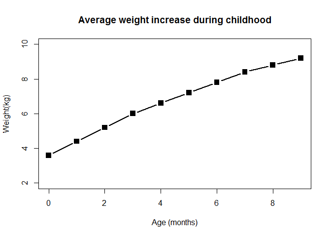
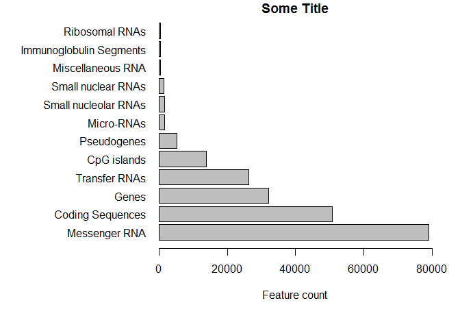
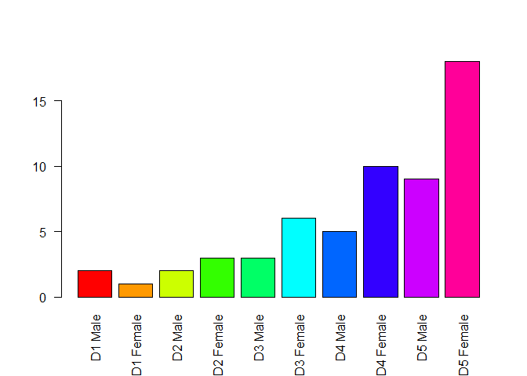
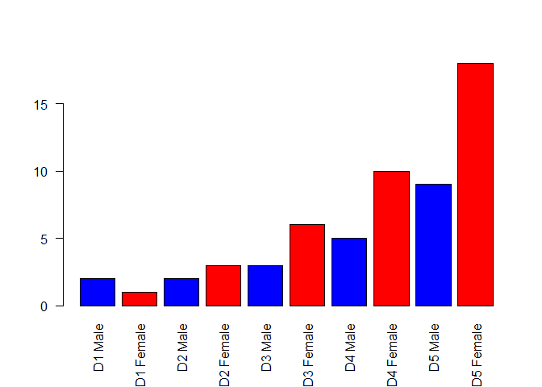
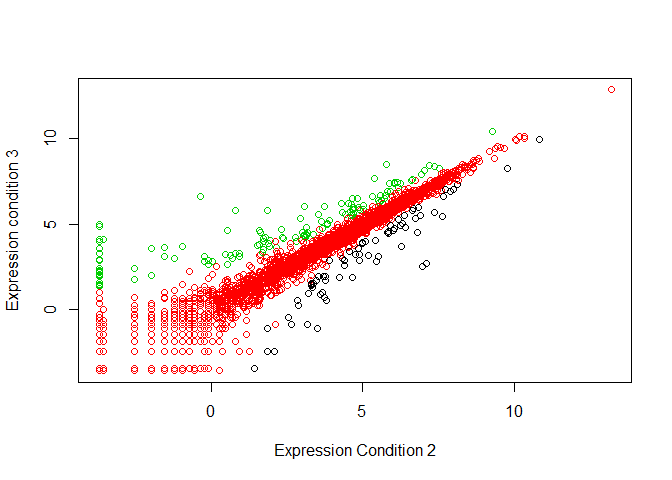
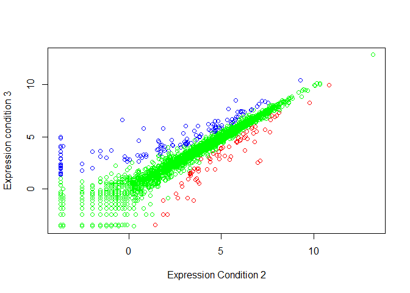
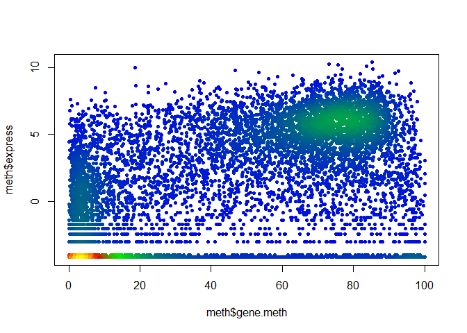
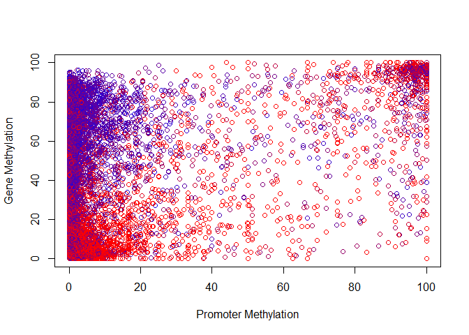

CLASS5
================

Drawing graphics with R studio
==============================

2A - Line Charts
----------------

``` r
weight <- read.table("bimm143_05_rstats/weight_chart.txt", header = TRUE)
plot(weight, type = "b", pch = 15, cex = 1.5, lwd = 2, ylim=c(2,10), xlab="Age (months)", ylab="Weight(kg)", main = "Average weight increase during childhood")
```



2B - Bar Plots
--------------

``` r
features <- read.delim("bimm143_05_rstats/feature_counts.txt")
par(mar=c(6.1,12.1,1.1,2.1))
barplot(features[,2], horiz = TRUE, xlim = c(0, 80000), xlab = "Feature count", names.arg = features[,1], main="Some Title", las = 1)
```



3A - Colors
-----------

``` r
genderwar <-  "bimm143_05_rstats/male_female_counts.txt"
boysGirls <- read.delim(genderwar, header = TRUE)
barplot(boysGirls[,2], names.arg = boysGirls[,1], las = 2, col = rainbow(nrow(boysGirls)))
```



``` r
barplot(boysGirls[,2], names.arg=boysGirls[,1], las = 2, col= c("blue", "red"))
```



3B - Coloring by numbers
------------------------

``` r
genes <- read.table("bimm143_05_rstats/up_down_expression.txt", header = TRUE)
plot (genes[,2], genes[,3], col = genes$State, xlab = "Expression Condition 2", ylab = "Expression condition 3")
```



``` r
palette(c("red", "green", "blue"))
plot (genes[,2], genes[,3], col = genes$State, xlab = "Expression Condition 2", ylab = "Expression condition 3")
```



3C - Dynamic Coloring
---------------------

``` r
meth = read.table("bimm143_05_rstats/expression_methylation.txt", header = TRUE)
color <- densCols(meth$gene.meth)
color.custom <- densCols(meth$gene.meth, meth$expression, colramp = colorRampPalette(c("blue2", "green2", "red2", "yellow")))
plot(meth$gene.meth, meth$express, col = color.custom, pch = 20)
```



4A - Followups
--------------

``` r
source("bimm143_05_rstats/color_to_value_map.r")

meth <- read.delim("bimm143_05_rstats/expression_methylation.txt", header = TRUE)
myColors <- map.colors(meth$expression,c(max(meth$expression), min(meth$expression)), colorRampPalette(c("blue", "red"))(100))

plot(meth$promoter.meth, meth$gene.meth, xlab = "Promoter Methylation", ylab = "Gene Methylation", col = myColors)
```


