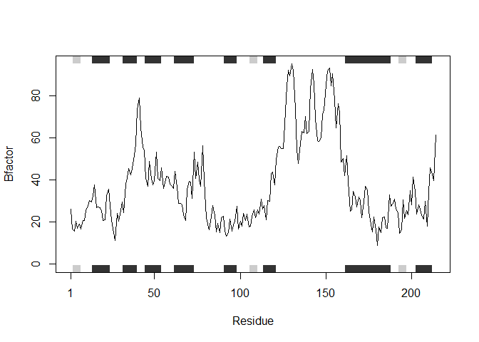

Class 6 HW
================
Mengdan Liu
January 28, 2019

Class 6 Homework - Making a plot function

This function has two input modes. In the first, the user must input a PDB code. The function will then output the A chain of the protein's B value plotted against its secondary structure. The second input mode again requires a PDB code, but the user can also specify which chain they'd like to plot. The function then outputs the specified chain's B value against its secondary structure.

``` r
#Function relies on functions from bio3d library.
library(bio3d)

#plotBFactor is a function that accepts a PDB iD as argument and outputs a graph of the corresponding protein's B-factor or the amount of wiggle atoms have in a structure(?)
plotChainBFactor <- function(pdbNum, chainLetter = "A"){
  #Assigning pdb coordinate file to variable s
  inPDB <- read.pdb(pdbNum)
  inChain <- chainLetter
  #Assigns chainA atom coordinates to var s.chainA using trim.pdb
  inPDB.chain <- trim.pdb(inPDB, chain=inChain, elety="CA")
  #Assigning chainA atom b values to s.b
  inPDB.bVals <- inPDB.chain$atom$b
  #Plotting b values against chainA secondary structure using plot3b
  plotb3(inPDB.bVals, sse = inPDB.chain, typ="l", ylab="Bfactor")
  
}
plotChainBFactor("4AKE")
```

    ##   Note: Accessing on-line PDB file


``` r
plotChainBFactor("4AKE", "B")
```

    ##   Note: Accessing on-line PDB file

    ## Warning in get.pdb(file, path = tempdir(), verbose = FALSE): C:
    ## \Users\FROOG_~1\AppData\Local\Temp\Rtmpq8x7RO/4AKE.pdb exists. Skipping
    ## download



A small error is output after the second function call. I think this is because I'm attempting to import the same PDB file twice (to the same variable?) but this does not seem to affect the function's functionality.
