CLASS8
================
Mengdan Liu
February 6, 2019

OUR TURN TO TRY K MEAN ANALYSIS

``` r
# Generate some example data for clustering
tmp <- c(rnorm(30,-3), rnorm(30,3))
x <- cbind(x=tmp, y=rev(tmp))
plot(x)
```

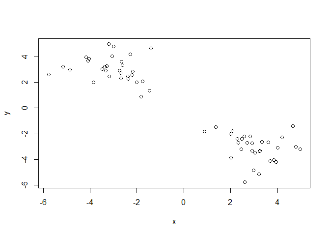

``` r
y <- kmeans(x, centers = 2, nstart=20)
y
```

    ## K-means clustering with 2 clusters of sizes 30, 30
    ## 
    ## Cluster means:
    ##           x         y
    ## 1 -3.037893  3.038077
    ## 2  3.038077 -3.037893
    ## 
    ## Clustering vector:
    ##  [1] 1 1 1 1 1 1 1 1 1 1 1 1 1 1 1 1 1 1 1 1 1 1 1 1 1 1 1 1 1 1 2 2 2 2 2
    ## [36] 2 2 2 2 2 2 2 2 2 2 2 2 2 2 2 2 2 2 2 2 2 2 2 2 2
    ## 
    ## Within cluster sum of squares by cluster:
    ## [1] 59.38025 59.38025
    ##  (between_SS / total_SS =  90.3 %)
    ## 
    ## Available components:
    ## 
    ## [1] "cluster"      "centers"      "totss"        "withinss"    
    ## [5] "tot.withinss" "betweenss"    "size"         "iter"        
    ## [9] "ifault"

``` r
plot(x, col = y$cluster)
```

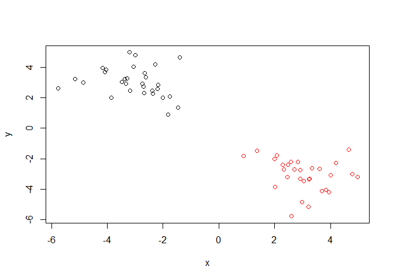 The next one ot learn is hierarchical clustering in R

``` r
# First we need to calculate point (dis)similarity
# as the Euclidean distance between observations
dist_matrix <- dist(x)
# The hclust() function returns a hierarchical
# clustering model
hc <- hclust(d = dist_matrix)
# the print method is not so useful here
hc
```

    ## 
    ## Call:
    ## hclust(d = dist_matrix)
    ## 
    ## Cluster method   : complete 
    ## Distance         : euclidean 
    ## Number of objects: 60

``` r
plot(hc)
```

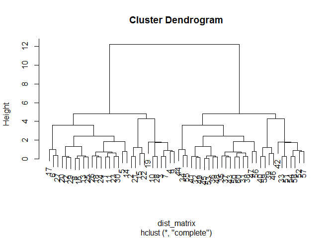

``` r
cutree(hc, h = 6)
```

    ##  [1] 1 1 1 1 1 1 1 1 1 1 1 1 1 1 1 1 1 1 1 1 1 1 1 1 1 1 1 1 1 1 2 2 2 2 2
    ## [36] 2 2 2 2 2 2 2 2 2 2 2 2 2 2 2 2 2 2 2 2 2 2 2 2 2

Dendrograms appear to relate data points based on their proximity to a cluster. Clusters are formed based on relative euclidean distance. This is a problem related to linking methods. In other words, how the hcluster program makes groups. Taking a look at a few of them right now.

``` r
hc.complete = hclust(d = dist_matrix, method = "complete")
hc.average = hclust(d = dist_matrix, method = "average")
hc.single = hclust(d = dist_matrix, method = "single")

plot(hc.complete)
```


``` r
plot(hc.average)
```

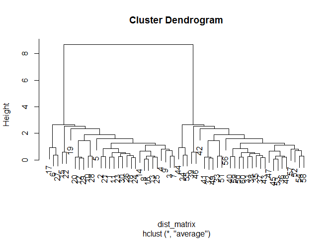

``` r
plot(hc.single)
```

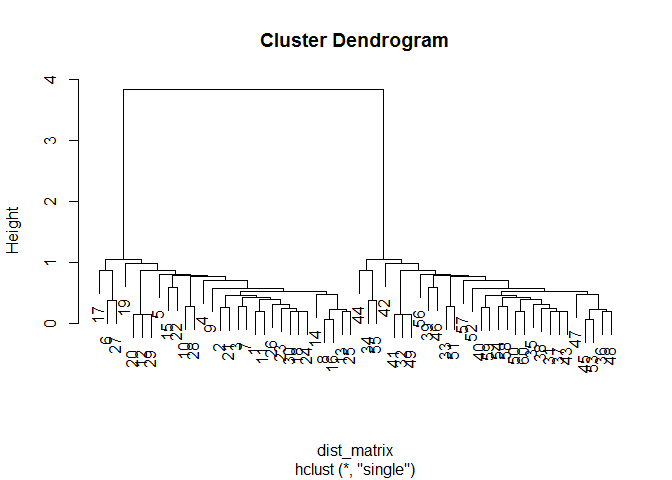

Time for some hands on work.

``` r
# Step 1. Generate some example data for clustering
x <- rbind(
 matrix(rnorm(100, mean=0, sd = 0.3), ncol = 2), # c1
 matrix(rnorm(100, mean = 1, sd = 0.3), ncol = 2), # c2
 matrix(c(rnorm(50, mean = 1, sd = 0.3), # c3
 rnorm(50, mean = 0, sd = 0.3)), ncol = 2))
colnames(x) <- c("x", "y")
# Step 2. Plot the data without clustering
plot(x)
```

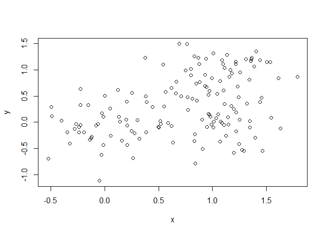

``` r
# Step 3. Generate colors for known clusters
# (just so we can compare to hclust results)
col <- as.factor( rep(c("c1","c2","c3"), each=50) )
plot(x, col=col)
```

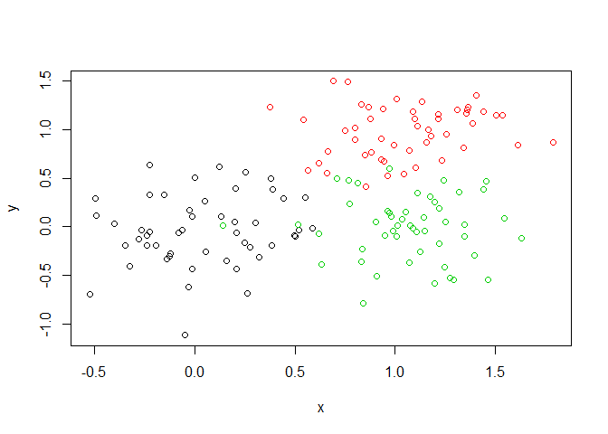

``` r
#QUESTION
#Identify 2-3 clusters using hclust, dist, plot, and cutree
dist_matrix2 <- dist(x)
hc2 <- hclust(d=dist_matrix2, method = "complete")
cut_hc2 <- cutree(hc2, h = 1.75)
plot(hc2)
```

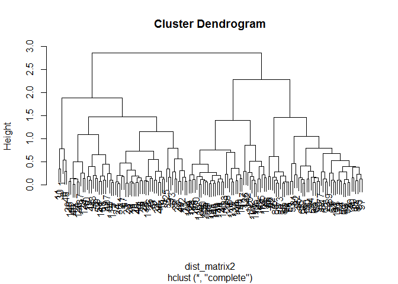

``` r
cut_hc2
```

    ##   [1] 1 2 2 2 2 1 2 2 2 2 1 2 2 2 2 2 2 2 2 2 2 2 2 2 2 2 2 2 2 1 2 2 2 2 2
    ##  [36] 2 2 2 2 2 2 2 2 2 2 2 2 1 2 2 3 3 3 3 3 3 3 2 2 3 3 3 3 3 3 3 3 3 3 3
    ##  [71] 3 3 3 3 3 3 3 3 3 3 3 3 3 3 3 3 3 3 3 3 2 3 3 3 3 3 3 3 2 3 4 4 4 4 4
    ## [106] 4 2 4 4 4 4 2 4 2 2 4 4 4 4 4 4 4 4 4 4 4 4 4 2 4 4 4 3 2 4 4 2 2 4 4
    ## [141] 2 4 4 4 2 4 4 4 4 4

``` r
plot(x, col=cut_hc2)
```

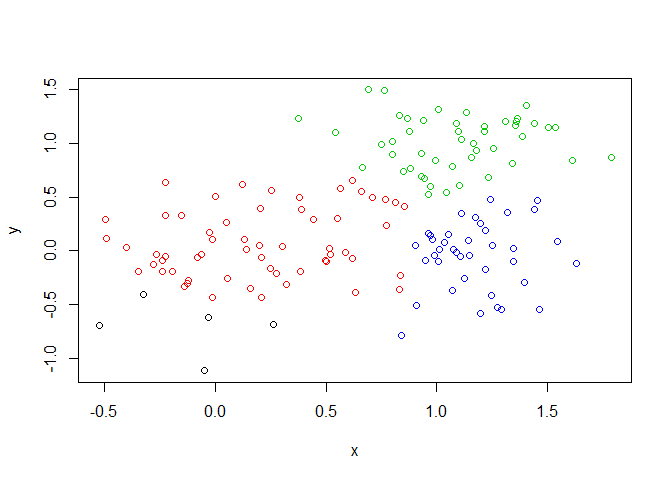

Moving onto PCA

``` r
mydata <- read.csv("https://tinyurl.com/expression-CSV",
 row.names=1) 
head(mydata)
```

    ##        wt1 wt2  wt3  wt4 wt5 ko1 ko2 ko3 ko4 ko5
    ## gene1  439 458  408  429 420  90  88  86  90  93
    ## gene2  219 200  204  210 187 427 423 434 433 426
    ## gene3 1006 989 1030 1017 973 252 237 238 226 210
    ## gene4  783 792  829  856 760 849 856 835 885 894
    ## gene5  181 249  204  244 225 277 305 272 270 279
    ## gene6  460 502  491  491 493 612 594 577 618 638

``` r
pca <- prcomp(t(mydata), scale=TRUE)
summary(pca)
```

    ## Importance of components:
    ##                           PC1    PC2     PC3     PC4     PC5     PC6
    ## Standard deviation     9.6237 1.5198 1.05787 1.05203 0.88062 0.82545
    ## Proportion of Variance 0.9262 0.0231 0.01119 0.01107 0.00775 0.00681
    ## Cumulative Proportion  0.9262 0.9493 0.96045 0.97152 0.97928 0.98609
    ##                            PC7     PC8     PC9      PC10
    ## Standard deviation     0.80111 0.62065 0.60342 3.348e-15
    ## Proportion of Variance 0.00642 0.00385 0.00364 0.000e+00
    ## Cumulative Proportion  0.99251 0.99636 1.00000 1.000e+00

``` r
plot(pca$x)
```


TIME FOR UNSUPERVISED WORK

``` r
#READING DATA
foo <- read.csv("data/UK_foods.csv", row.names=1)
head(foo)
```

    ##                England Wales Scotland N.Ireland
    ## Cheese             105   103      103        66
    ## Carcass_meat       245   227      242       267
    ## Other_meat         685   803      750       586
    ## Fish               147   160      122        93
    ## Fats_and_oils      193   235      184       209
    ## Sugars             156   175      147       139

``` r
#OBSERVING DIFFERENCES IN DATA
barplot(as.matrix(foo), beside = FALSE, col=rainbow(nrow(foo)))
```


``` r
pairs(foo, col=rainbow(10), pch=16)
```

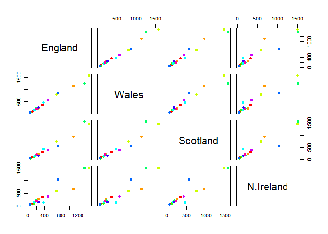

``` r
pca <- prcomp(t(foo))
summary(pca)
```

    ## Importance of components:
    ##                             PC1      PC2      PC3       PC4
    ## Standard deviation     324.1502 212.7478 73.87622 4.189e-14
    ## Proportion of Variance   0.6744   0.2905  0.03503 0.000e+00
    ## Cumulative Proportion    0.6744   0.9650  1.00000 1.000e+00

``` r
plot(pca$x[,1], pca$x[,2], xlab = "PC1", ylab="PC2", xlim=c(-270,500))
col.vec <- c("orange", "red", "blue", "green")
text(pca$x[,1], pca$x[,2], colnames(foo), col = col.vec)
```

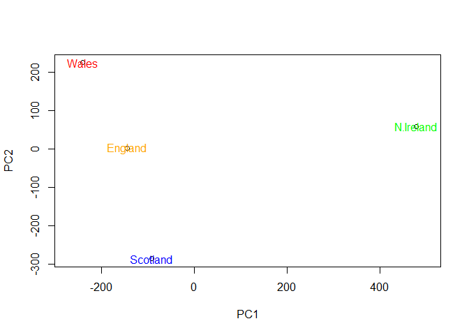
