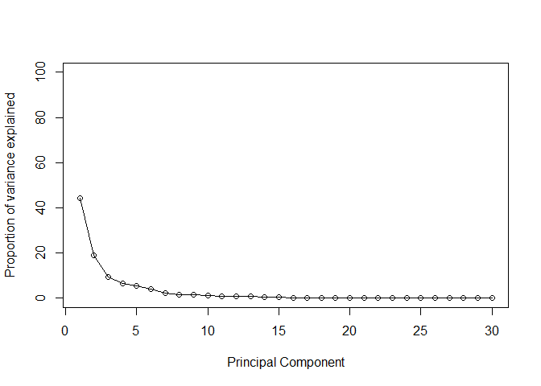
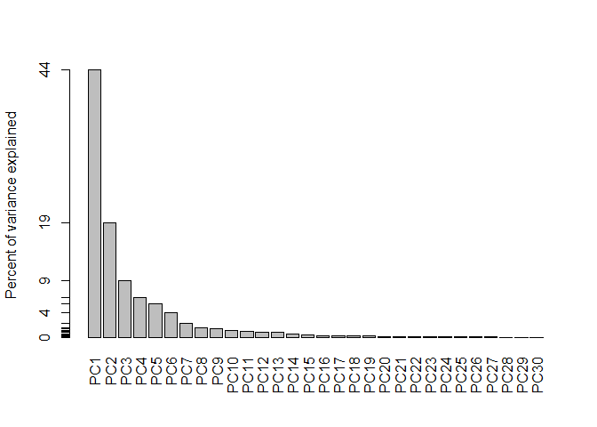
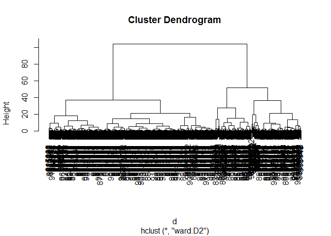
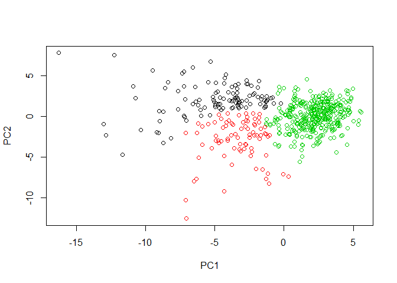
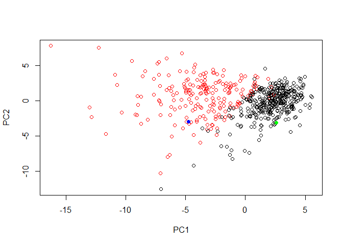

CLASS9
================
Mengdan Liu
February 8, 2019

Importing Wisconsin Cancer Data

``` r
fna.data <- "data/WisconsinCancer.csv"
wisc.df <- read.csv(fna.data, header=TRUE)
```

Removing unnecessary data columns and applying rownames from data frame source.

``` r
wisc.data <- wisc.df[,3:32]
rownames(wisc.data) <- wisc.df$id
```

Identifying number of malignant or benign cases of cancer.

``` r
table(wisc.df$diagnosis)
```

    ## 
    ##   B   M 
    ## 357 212

How many features are "mean" values?

``` r
names <- colnames(wisc.data)
length(grep("_mean", names, ignore.case = TRUE))
```

    ## [1] 10

Another example where we shrink the dataset and return column name by indexing

``` r
indexes <- grep("_mean", colnames(wisc.data), ignore.case=TRUE)
colnames(wisc.data)[indexes]
```

    ##  [1] "radius_mean"            "texture_mean"          
    ##  [3] "perimeter_mean"         "area_mean"             
    ##  [5] "smoothness_mean"        "compactness_mean"      
    ##  [7] "concavity_mean"         "concave.points_mean"   
    ##  [9] "symmetry_mean"          "fractal_dimension_mean"

PCA ANALYSIS BEGINS Checking data to see if scaling is necessary

``` r
round(apply(wisc.data, 2, mean), 2)
```

    ##             radius_mean            texture_mean          perimeter_mean 
    ##                   14.13                   19.29                   91.97 
    ##               area_mean         smoothness_mean        compactness_mean 
    ##                  654.89                    0.10                    0.10 
    ##          concavity_mean     concave.points_mean           symmetry_mean 
    ##                    0.09                    0.05                    0.18 
    ##  fractal_dimension_mean               radius_se              texture_se 
    ##                    0.06                    0.41                    1.22 
    ##            perimeter_se                 area_se           smoothness_se 
    ##                    2.87                   40.34                    0.01 
    ##          compactness_se            concavity_se       concave.points_se 
    ##                    0.03                    0.03                    0.01 
    ##             symmetry_se    fractal_dimension_se            radius_worst 
    ##                    0.02                    0.00                   16.27 
    ##           texture_worst         perimeter_worst              area_worst 
    ##                   25.68                  107.26                  880.58 
    ##        smoothness_worst       compactness_worst         concavity_worst 
    ##                    0.13                    0.25                    0.27 
    ##    concave.points_worst          symmetry_worst fractal_dimension_worst 
    ##                    0.11                    0.29                    0.08

``` r
print("STANDARD DEVIATIONS")
```

    ## [1] "STANDARD DEVIATIONS"

``` r
round(apply(wisc.data, 2, sd), 2)
```

    ##             radius_mean            texture_mean          perimeter_mean 
    ##                    3.52                    4.30                   24.30 
    ##               area_mean         smoothness_mean        compactness_mean 
    ##                  351.91                    0.01                    0.05 
    ##          concavity_mean     concave.points_mean           symmetry_mean 
    ##                    0.08                    0.04                    0.03 
    ##  fractal_dimension_mean               radius_se              texture_se 
    ##                    0.01                    0.28                    0.55 
    ##            perimeter_se                 area_se           smoothness_se 
    ##                    2.02                   45.49                    0.00 
    ##          compactness_se            concavity_se       concave.points_se 
    ##                    0.02                    0.03                    0.01 
    ##             symmetry_se    fractal_dimension_se            radius_worst 
    ##                    0.01                    0.00                    4.83 
    ##           texture_worst         perimeter_worst              area_worst 
    ##                    6.15                   33.60                  569.36 
    ##        smoothness_worst       compactness_worst         concavity_worst 
    ##                    0.02                    0.16                    0.21 
    ##    concave.points_worst          symmetry_worst fractal_dimension_worst 
    ##                    0.07                    0.06                    0.02

Performing PCA & plotting analysis

``` r
wisc.pr <- prcomp(wisc.data, scale=TRUE)
summary(wisc.pr)
```

    ## Importance of components:
    ##                           PC1    PC2     PC3     PC4     PC5     PC6
    ## Standard deviation     3.6444 2.3857 1.67867 1.40735 1.28403 1.09880
    ## Proportion of Variance 0.4427 0.1897 0.09393 0.06602 0.05496 0.04025
    ## Cumulative Proportion  0.4427 0.6324 0.72636 0.79239 0.84734 0.88759
    ##                            PC7     PC8    PC9    PC10   PC11    PC12
    ## Standard deviation     0.82172 0.69037 0.6457 0.59219 0.5421 0.51104
    ## Proportion of Variance 0.02251 0.01589 0.0139 0.01169 0.0098 0.00871
    ## Cumulative Proportion  0.91010 0.92598 0.9399 0.95157 0.9614 0.97007
    ##                           PC13    PC14    PC15    PC16    PC17    PC18
    ## Standard deviation     0.49128 0.39624 0.30681 0.28260 0.24372 0.22939
    ## Proportion of Variance 0.00805 0.00523 0.00314 0.00266 0.00198 0.00175
    ## Cumulative Proportion  0.97812 0.98335 0.98649 0.98915 0.99113 0.99288
    ##                           PC19    PC20   PC21    PC22    PC23   PC24
    ## Standard deviation     0.22244 0.17652 0.1731 0.16565 0.15602 0.1344
    ## Proportion of Variance 0.00165 0.00104 0.0010 0.00091 0.00081 0.0006
    ## Cumulative Proportion  0.99453 0.99557 0.9966 0.99749 0.99830 0.9989
    ##                           PC25    PC26    PC27    PC28    PC29    PC30
    ## Standard deviation     0.12442 0.09043 0.08307 0.03987 0.02736 0.01153
    ## Proportion of Variance 0.00052 0.00027 0.00023 0.00005 0.00002 0.00000
    ## Cumulative Proportion  0.99942 0.99969 0.99992 0.99997 1.00000 1.00000

BIPLOT METHOD

``` r
biplot(wisc.pr)
```


Standard PCA plot 1 & 2 / 1 & 3

``` r
plot(wisc.pr$x[,1], wisc.pr$x[,2], xlab= "PC1", ylab = "PC2", col = wisc.df$diagnosis)
```


``` r
plot(wisc.pr$x[,1], wisc.pr$x[,3], xlab= "PC1", ylab = "PC3", col = wisc.df$diagnosis)
```


Variance exercises

``` r
pr.var <- wisc.pr$sdev^2
pve <- round(pr.var/sum(pr.var)*100, 2)

plot(pve, type = "o", xlab="Principal Component", ylab = "Proportion of variance explained", ylim = c(0,100))
```



``` r
##Scree Barplot next
barplot(pve, ylab = "Percent of variance explained", names.arg = paste0("PC", 1:length(pve)), las = 2, axes = FALSE)
axis(2, at = pve, labels = round(pve))
```



Clustering in Principal Component space

``` r
d <- dist (wisc.pr$x[,1:2])
hc <- hclust(d,method="ward.D2")
plot(hc)
```



``` r
grp3 <- cutree(hc, k=3)
table(grp3)
```

    ## grp3
    ##   1   2   3 
    ## 112  83 374

Plotting PCA with color by group as determined by hcluster analysis

``` r
plot(wisc.pr$x[,1], wisc.pr$x[,2], xlab="PC1", ylab = "PC2", col = grp3)
```

 Cross tabulation

``` r
diagnosisM <- wisc.df$diagnosis == "M"
table(grp3, diagnosisM)
```

    ##     diagnosisM
    ## grp3 FALSE TRUE
    ##    1     0  112
    ##    2    18   65
    ##    3   339   35

USING THE PREDICT FUNCTION

``` r
url <- "https://tinyurl.com/new-samples-CSV"
new <- read.csv(url)
npc <- predict(wisc.pr, newdata=new)
npc
```

    ##            PC1       PC2        PC3        PC4       PC5        PC6
    ## [1,]  2.576616 -3.135913  1.3990492 -0.7631950  2.781648 -0.8150185
    ## [2,] -4.754928 -3.009033 -0.1660946 -0.6052952 -1.140698 -1.2189945
    ##             PC7        PC8       PC9       PC10      PC11      PC12
    ## [1,] -0.3959098 -0.2307350 0.1029569 -0.9272861 0.3411457  0.375921
    ## [2,]  0.8193031 -0.3307423 0.5281896 -0.4855301 0.7173233 -1.185917
    ##           PC13     PC14      PC15       PC16        PC17        PC18
    ## [1,] 0.1610764 1.187882 0.3216974 -0.1743616 -0.07875393 -0.11207028
    ## [2,] 0.5893856 0.303029 0.1299153  0.1448061 -0.40509706  0.06565549
    ##             PC19       PC20       PC21       PC22       PC23       PC24
    ## [1,] -0.08802955 -0.2495216  0.1228233 0.09358453 0.08347651  0.1223396
    ## [2,]  0.25591230 -0.4289500 -0.1224776 0.01732146 0.06316631 -0.2338618
    ##             PC25         PC26         PC27        PC28         PC29
    ## [1,]  0.02124121  0.078884581  0.220199544 -0.02946023 -0.015620933
    ## [2,] -0.20755948 -0.009833238 -0.001134152  0.09638361  0.002795349
    ##              PC30
    ## [1,]  0.005269029
    ## [2,] -0.019015820

``` r
#APPLYING DATASET TO EXISTING PCA PLOT
plot(wisc.pr$x[,1:2], col = wisc.df$diagnosis)
points(npc[,1], npc[,2], col = c("green", "blue"), pch=16)
```


